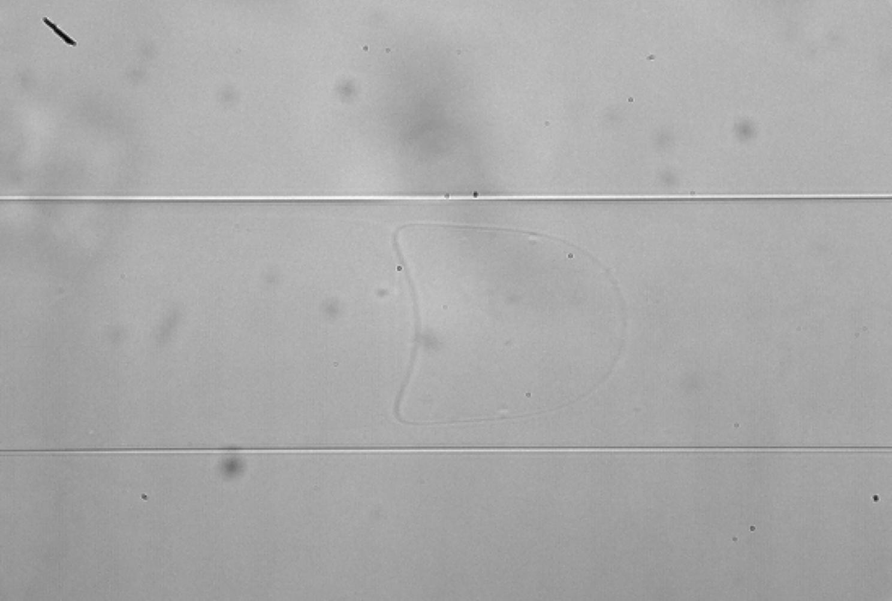
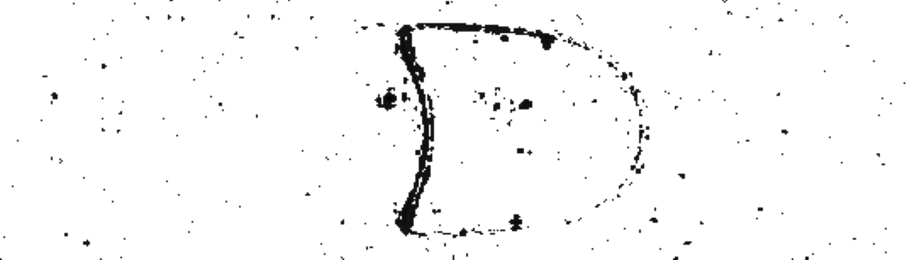
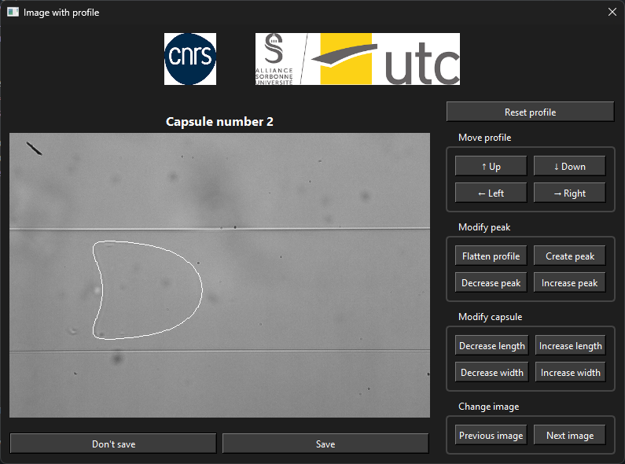

# Low Contrast Image Segmentation

## Project Overview

This project addresses the challenge of segmenting capsules in **extremely low-contrast biological imagery**. The primary goal is to automatically detect and precisely segment capsule boundaries in scan images where contrast is minimal, making manual identification difficult and time-consuming.

Due to the confidential nature of this project, the source code is not publicly available. However, this document outlines the methodology, pipeline, and results achieved.

## Context

Biological imaging presents images with very low contrast between the object of interest (capsule) and the background. This makes traditional segmentation approaches challenging. The project implements a complete pipeline to enhance contrast and accurately locate capsule boundaries using advanced image processing techniques.

### Original Image

Below is an example of a capsule into a channel:

The above image demonstrates the difficulty: the capsule outline is barely visible against the background.

## Solution Pipeline

1. Channel Extraction
2. Contrast Enhancement
3. Denoising

### Enhanced Image

Below is the result after applying the contrast enhancement pipeline:

The enhancement dramatically improves capsule visibility while maintaining structural integrity.

### Capsule Segmentation

**Template Matching Approach:**

- A reference template of the expected capsule shape is created
- The template is matched across the enhanced image using correlation-based methods
- Template matching serves dual purposes:
  - **Image Filtering**: Segments relevant regions containing potential capsules
  - **Boundary Segmentation**: Precisely localizes the capsule outline

This approach provides robustness against remaining noise and complete capsule boundaries.

## Results

The segmentation pipeline achieved **95% success rate** on the test dataset. This high accuracy demonstrates the effectiveness of the contrast enhancement and template matching strategy.

### Segmentation Example

Below is the final segmentation result, showing the automatically detected capsule boundary:

On the left, the original image with the detected capsule boundary is shown. On the right, few buttons can be used by the user to modify the segmentation result, such as change the capsule length and width, etc.

## Deliverable

A **Python executable application** was developed as the final deliverable. This application:

- Processes images automatically (including videos)
- Applies the complete contrast enhancement pipeline 
- Performs template matching-based segmentation
- Outputs segmentation results with confidence metrics
- Provides a user-friendly interface for visualizing and modifying results

## Technical Stack

- **Image Processing**: Python with OpenCV and NumPy
- **Algorithm**: Template matching with correlation-based detection, Canny edge detection, etc.
- **Application**: Executable Python application for end-user use

---

**Note:** Due to confidentiality agreements, detailed source code and dataset information cannot be shared publicly.
